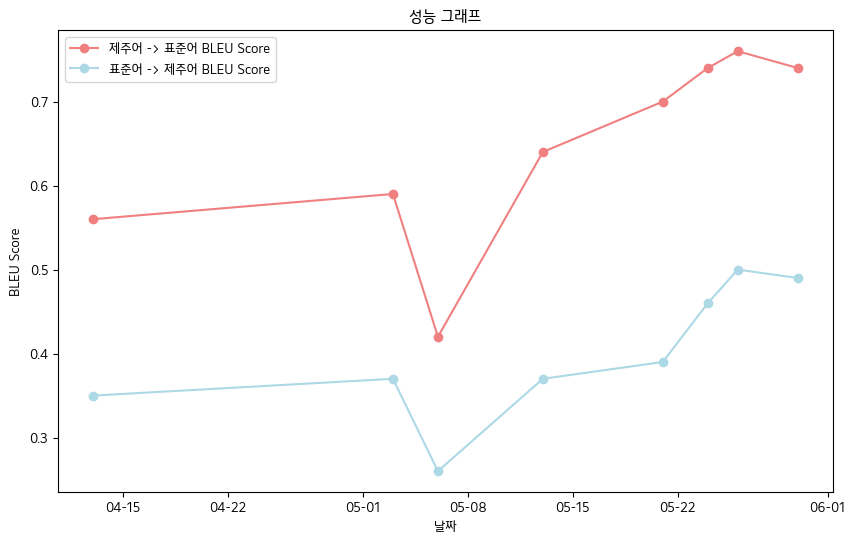

# 🌊 제주어, 표준어 양방향 음성 번역 모델 생성 프로젝트 

## 모델 사용법
```python
import torch
from transformers import AutoTokenizer, AutoModelForSeq2SeqLM

## Set up the device (GPU or CPU)
device = torch.device("cuda" if torch.cuda.is_available() else "cpu")

## Load the tokenizer and model
tokenizer = AutoTokenizer.from_pretrained("Junhoee/Kobart-Jeju-translation")
model = AutoModelForSeq2SeqLM.from_pretrained("Junhoee/Kobart-Jeju-translation").to(device)

## Set up the input text
## 문장 입력 전에 방향에 맞게 [제주] or [표준] 토큰을 입력 후 문장 입력
input_text = "[표준] 안녕하세요"

## Tokenize the input text
input_ids = tokenizer(input_text, return_tensors="pt", padding=True, truncation=True).input_ids.to(device)

## Generate the translation
outputs = model.generate(input_ids, max_length=64)

## Decode and print the output
decoded_output = tokenizer.decode(outputs[0], skip_special_tokens=True)
print("Model Output:", decoded_output)
```
```java
Model Output: 안녕하수꽈
```
## 🎯 1. 프로젝트 소개
### 🧑‍🤝‍🧑 **팀원**
- **비타민 12기 : 구준회(Leader), 이서현, 이예린**
- **비타민 13기 : 김윤영, 김재겸, 이형석**

### 📅 **시기**
- **2024년 1학기**

### 🕹️ **주제**
- **제주 방언과 표준어 양방향 번역 모델 생성**

### 😄 **역할**
- **데이터 관리 전반과 모델링** 관련 부분을 맡아서 수행했습니다.
- **데이터 관련 : 데이터 수집, 데이터 전처리 및 후처리, 데이터 증강, EDA**
- **모델 관련 : 번역 모델 탐색, 모델 파인 튜닝**

### 🎯 **목표**
- 제주 방언에 대한 이해를 증진시키고, 제주 문화의 보존에 기여하고자 합니다.
- 제주 지역도민과 원활한 의사소통을 도모합니다.
- 제주 사투리와 한국어 표준어 사이를 연결하는 양방향 번역 모델을 개발합니다.
- 음성 인식 기능과 사용자 인터페이스를 구현합니다.

## 📊 2. 데이터 수집
- **AI-Hub에서 수집한 데이터**
  - 한국어 방언 발화 데이터
  - 중·노년층 한국어 방언 데이터

- **Github에서 수집한 데이터**
  - 카카오 JIT 제주 방언 데이터

- **그 외 데이터**
  - 생활제주어 데이터 (제주어사전 웹페이지 크롤링)
  - 뭐랭하맨 데이터 (유튜버 뭐랭하맨 영상 중 가사 번역 영상 참고해 데이터 수집)
  - 제주방언 그 맛과 멋 데이터 (도서 '제주방언 그 맛과 멋'에서 데이터 수집)
  - 부에나도 지꺼져도 데이터 (도서 '부에나도 지꺼져도'에서 데이터 수집)
  - 2018 제주어 구술 자료집 (평가용으로 수집)

## 💻 3. 모델 학습
### 3-1. 모델 관련
- **사전 학습 모델을 불러와 Fine-tuning 하는 방식**으로 학습하였습니다.
- 번역 모델 개발을 위해 활용한 사전 학습 모델:
  - **gogamza/kobart-base-v2**  

- **사전 학습 모델 선택 기준**
  - 번역 Task에 적합한 모델인가?
  - 한국어로 학습되어 있는가?
  - 모델 용량이 그리 크지 않고 학습 속도가 빠른가?

- 고려해봤지만 선택하지 않은 모델:
  - T5 (학습 시간이 너무 긴 문제가 있음)
  - Jebert (성능이 만족스럽지 않았음)
 
### 3-2. 학습 방법
- **학습 방법론**
  - **source -> target** 형식으로 학습
  - **문장 입력 전에 [제주] 혹은 [표준] 토큰을 추가하여 번역 방향을 명시하고 이를 함께 학습**
  - datasets 패키지의 Dataset을 활용하여 언어 모델 학습에 최적화된 형태로 변환
 
- **주요 파라미터 설정**
  - **max_length : 64**
  - **batch_size : 32**
  - **traning_rate : 처음에는 2e-5에서 시작해 학습이 진행되면서 점차 줄어들도록 설정**
  - **epochs : 3**
 
## 📈 4. 주요 성과
- **최종 BLEU 점수 - 제주어 구술 자료집 데이터 기준**
    - **제주어 -> 표준어 : 0.76**
    - **표준어 -> 제주어 : 0.5**
- **BLEU Score 성능 표**

| 날짜          | 04-13 | 05-03 | 05-06 | 05-13 | 05-21 | 05-24 | 05-26 | 05-30 |
|---------------|------------|------------|------------|------------|------------|------------|------------|------------|
| **제주어->표준어 BLEU Score** | 0.56 | 0.59 | 0.42 | 0.64 | 0.70 | 0.74 | **0.76** | 0.74 |
| **표준어->제주어 BLEU Score** | 0.35 | 0.37 | 0.26 | 0.37 | 0.39 | 0.46 | **0.50** | 0.49 |

- 전체적으로 **우상향하는 BLEU Score을 기록**하였습니다.


- **인터페이스 구현**

- **음성 인식 기능**
  - **STT**
    - 허깅페이스에서 Whisper 모델 받아서 Fine-tuning 진행
    - 제주어 억양 학습해 text로 변환
  - **TTS**
    - 허깅페이스에서 glos TTS, hifigan 모델 받아서 fine-tuning 진행
    - 제주어 억양으로 음성 표현 시도했지만 실패...
    - 표준어 음성으로 대신 표현 (gtts 사용)
 
## 🔍 5. 향후 계획  
- 양질의 데이터 확보를 위해 추가적인 데이터 수집과 문법적 미세 조정을 통한 전처리 수행
- 음성 인식 모델의 억양 인식 능력 향상
- 웹 구현 및 모바일 앱 개발 계획
 
    
## 🧹 6. 참조
- **데이터 출처**
  - 한국어 방언 발화 데이터 (AI-Hub 제공) : https://www.aihub.or.kr/aihubdata/data/view.do?currMenu=115&topMenu=100&aihubDataSe=data&dataSetSn=121
  - 중·노년층 한국어 방언 데이터 (AI-Hub 제공) : https://www.aihub.or.kr/aihubdata/data/view.do?currMenu=115&topMenu=100&aihubDataSe=data&dataSetSn=71558
  - 카카오 JIT 제주 방언 데이터 (카카오브레인 Github 참조) : https://github.com/kakaobrain/jejueo
  - 생활제주어 데이터 (제주어사전 참조) : https://www.jeju.go.kr/culture/dialect/lifeDialect.htm
- **모델 출처**


# 전체 회의 요약 보고서

## 상위 키워드

LLM,, 청킹,, 회의,, 인퍼런스,, 유사도,

## 목차

1. API 인포런스 요청
2. STT 결과 최적화
3. LLM 학습과 인퍼런스 시간 문제
4. 인퍼런스 서버 자원 관리
5. 청킹 파트 매핑 및 유사도 비교
6. 청킹 매핑을 통한 문제 해결
7. 청킹 알고리즘 수정 제안
8. LLM 청크 다이어그램 생성
9. LLM 다이어그램 생성 실험
10. LLM 실험 및 청크 처리
11. API 키 및 프로젝트 진행 계획
12. 회의 일정 및 방식 변경
13. 회의 시간 정하기
14. 월요일 회의 준비
15. 축제 일정 조정
16. 프로토타입 배포 및 영상 제작 논의


## API 인포런스 요청

**요약 3문장**:

.

---

## STT 결과 최적화

**요약 3문장**:

.

---

## LLM 학습과 인퍼런스 시간 문제

**요약 3문장**:

.

---

## 인퍼런스 서버 자원 관리

**요약 3문장**:

인퍼런스 서버에서 자원을 관리할 때 콜앱과 외부 GPU 환경의 차이를 고려해야 한다. 블로썸 서버에서도 인퍼런스가 가능하지만, 외부 GPU 환경에서의 실행 시간을 고려해야 한다. 이를 위해 블로썸 유저들의 자원 사용에 대한 검색과 분석을 통해 최적의 자원 선택을 할 수 있다.

---

## 청킹 파트 매핑 및 유사도 비교

**요약 3문장**:

인퍼런스 시간을 절약하기 위해 청킹 파트를 유사도 기준으로 매핑하는 방법을 제안합니다. 이를 통해 청킹의 길이가 짧은 경우 다이어그램 생성을 생략할 수 있으며, 문장의 반복적인 등장을 동시에 해결할 수 있습니다. 이를 통해 일정한 토큰 수를 채우면서 청크의 길이를 조절할 수 있습니다.

---

## 청킹 매핑을 통한 문제 해결

**요약 3문장**:

청킹을 사용하여 기존 오픈 소스 라이브러리를 매핑하면 문제를 해결할 수 있을 것이라 생각합니다. 그러나 현재 청킹이 너무 많이 발생하고 쓸모없는 청크가 많아 문제가 발생합니다. 이를 해결하기 위해 청킹을 다시 여러 개로 매핑하는 과정을 거치는 것이 필요합니다.

---

## 청킹 알고리즘 수정 제안

**요약 3문장**:

유사도 기반의 청킹즈를 매핑하는 기술을 사용하면 유사한 요소들을 합칠 수 있다는 생각이 들었습니다. 청킹 알고리즘을 수정하여 원하는 결과값을 얻을 수 있을 것이라 판단했습니다. 이를 위해 코드를 수정하여 유사도를 높게 잡아 유사한 요소들을 묶을 수 있습니다.

---

## LLM 청크 다이어그램 생성

**요약 3문장**:

LLM에서 청크의 길이가 짧고 반복적인 등장도 괜찮을 것 같으며, 이를 통해 청크가 너무 많이 쪼개지는 문제도 해결될 수 있을 것 같다..

---

## LLM 다이어그램 생성 실험

**요약 3문장**:

.

---

## LLM 실험 및 청크 처리

**요약 3문장**:

.

---

## API 키 및 프로젝트 진행 계획

**요약 3문장**:

.

---

## 회의 일정 및 방식 변경

**요약 3문장**:

1. 회의는 기존 일정대로 월요일에 계속될 예정입니다..

---

## 회의 시간 정하기

**요약 3문장**:

회의 시간을 정하기 위해 시를 기준으로 논의했으며, 다음 날 출근 후 피곤하지 않겠다고 확인했습니다. 수요일이나 목요일이 회의 시간으로 적합하다고 판단했으며, 시 이후에는 회의 시간을 자유롭게 정할 수 있다고 했습니다. 수요일이 최종적으로 정해졌습니다.

---

## 월요일 회의 준비

**요약 3문장**:

월요일 회의 전까지의 작업을 월요일 시간 전에 하지 않기로 결정했다. 월요일 회의 시간을 정해주면 노션에 정리된 내용을 전달하겠다고 했다. 월요일 회의 전에 각자 정리한 내용을 대표자 회의 전에 올리기로 했다.

---

## 축제 일정 조정

**요약 3문장**:

이번 주 수요일 축제에 참석할지에 대해 논의했으며, 다음 주 목요일로 일정을 조정할 수 있다고 결정했다. 목요일에는 연예인이 참석할 예정이었으나, 목요일 일정은 없는 것으로 보인다. 따라서 목요일로 일정을 조정하기로 했다.

---

## 프로토타입 배포 및 영상 제작 논의

**요약 3문장**:

.

---


  - Kobart Hugging Face : https://huggingface.co/gogamza/kobart-base-v2
  - Whisper Hugging Face : https://huggingface.co/openai/whisper-large-v2
  - Kobart Github : https://github.com/SKT-AI/KoBART
